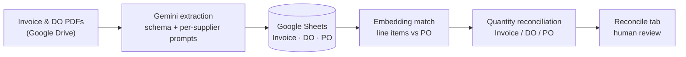
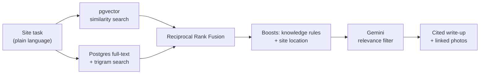

---

# 💫 About Me
I'm a Data Science undergraduate moving from classical machine learning into **AI engineering**. I love diving into datasets to solve quantitative problems, from tournament bracket simulations to user-behavior patterns, and I now apply that curiosity to building reliable, production-minded AI systems.

- 🎓 Data Science undergrad at Multimedia University (MMU)
- 🤖 AI engineering intern, shipping LLM-powered tools to real users
- 🎯 Focus: RAG, hybrid search, LLM document pipelines
- ☁️ Building and deploying on Google Cloud
- 🎬 Leading branding and social media for the Data Science & AI Club (DATAI)

---

# 🚀 What I'm Working On

## 🧾 3-Way Matching (Invoice ↔ Delivery Order ↔ Purchase Order)
An end-to-end procurement reconciliation pipeline that surfaces over-billing and missing deliveries automatically.

- Schema-driven extraction with Gemini on Vertex AI, using per-supplier prompt profiles to handle varying document formats
- Line items matched to the buyer's Purchase Order by embedding similarity, then reconciled quantity-by-quantity
- Human-in-the-loop review happens directly in Sheets via an Apps Script trigger, so there is no separate UI to maintain

## 🦺 Project Guardrail (RAG)
A hybrid-search agent that turns a plain-language site task (e.g. "lifting works near excavation") into cited safety precautions drawn from past inspection observations.

- Hybrid retrieval: pgvector similarity and Postgres full-text/trigram search, fused with Reciprocal Rank Fusion
- Engineer-authored knowledge rules (task pattern → hazard category, matched by embedding similarity) and site-location matching boost relevant results
- Stays silent on gibberish input instead of returning irrelevant results
- Write-ups include linked inspection and rectification photos from cloud storage, with an AI-advisory, human-confirmed relevance check
- FastAPI + Streamlit on Cloud Run, Postgres/pgvector on Cloud SQL, iterated on real user feedback

---

# 💻 Tech Stack & Tools

### ⚙️ Programming Languages
   

### 🤖 AI Engineering
    

**Focus areas:** retrieval-augmented generation (RAG), hybrid (vector + keyword) search, prompt-based document extraction, LLM pipelines, iterating on real user feedback

### ☁️ Cloud & Data Infrastructure
        

### 📊 Data Analytics & Machine Learning
    

### 🌐 Frameworks & Document Formatting
  

### 🎨 Creative & Design Tools
 

---

# 📊 GitHub Stats

  
  

### ✍️ Random Dev Quote

